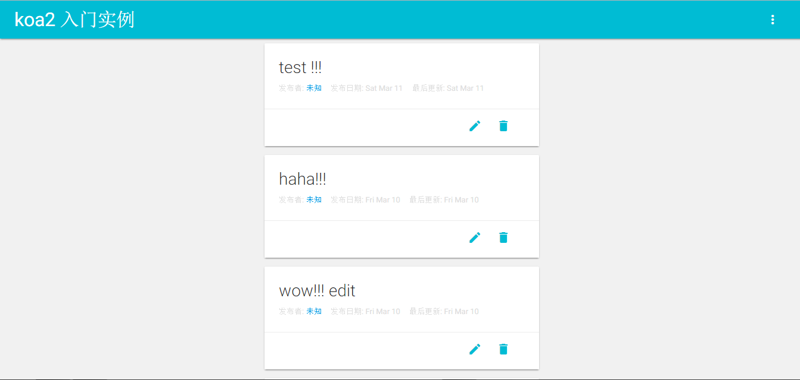

# koa2入门实例 (未完成)

## 前言
随着koa2以及Nodejs 7.6版本的发布
## 效果图


## 开发
  首先需要安装需要的依赖
- [mongoose](http://mongoosejs.com/)
- [koa](https://github.com/koajs/koa)
- [ejs](https://github.com/mde/ejs)
- [koa-router](https://github.com/alexmingoia/koa-router)
- [koa-views](https://github.com/queckezz/koa-views)
- [koa-bodyparser](https://github.com/koajs/bodyparser)

### 数据
使用mongoose创建两个数据模型, 用户模型User, 消息模型Message
```javascript
const mongoose = require('mongoose')

const userSchema = mongoose.Schema({
  username: {type: String, required: true, uinique: true},
  password: {type: String, required: true},
  token: {type: String},
  create_at: {type: Date, default: Date.now}
})

const User = mongoose.model('User', userSchema)
module.exports = User
```

### 页面
使用EJS模板引擎

### 路由
使用koa-router控制路由

## 结语

## LICENSE

[MIT](./LICENSE)  

written by [xrr2016](https://github.com/xrr2016), 欢迎issue,fork, star.
